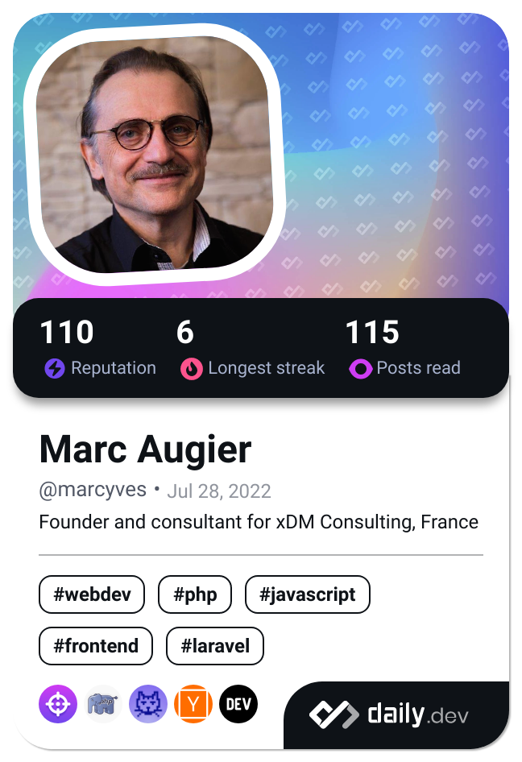

# Marc Augier

### Consultant & formateur freelance · [xDM Consulting](https://www.xdm-consulting.fr)

*J’aide les équipes à livrer plus sereinement : **qualité logicielle**, **standards de code** et **montée en compétence** (BackEnd, Laravel, Python, systèmes d’information).*

---

## En bref

Consultant et formateur indépendant depuis **2016** ([xDM Consulting](https://www.xdm-consulting.fr)). Ex-directeur de département **SI & knowledge management** (SKEMA, contexte international), ex-consultant **Accenture**. Mes dépôts hébergent principalemnt des **supports de cours** et des **projets personnels**.

| | |
|:---:|:---:|
| **Formation & code ouvert** | **Conseil & delivery** |
| Cours Python, qualité du code, outils SI | Audits, standards, ateliers, accompagnement d’équipes |
| ~**9 000** inscrits cumulés (dispositifs en ligne) | Groupes de **10 à 1 500** participants, présentiel & distanciel |
| [Udemy](https://www.udemy.com/user/marcaugier/)| Transformation digitale, documentation, gouvernance |

---

## Ce que je fais

- **Conseil (xDM)** — réduire la dette technique, structurer la revue de code et les pratiques d’équipe, cadrer la documentation et les indicateurs.
- **Formation** — Python, qualité du code, systèmes d’information et bases de données ; publics école, entreprise et auto-formation.
- **Ressources open source** — exemples de cours et scripts réutilisables (fork & adapt welcome).

---

## Dépôts à découvrir

| Dépôt | Description |
|-------|-------------|
| [**Python-3-Formation-complete**](https://github.com/marcyves/Python-3-Formation-complete) | Formation intensive Python |
| [**petits-jeux-Python**](https://github.com/marcyves/petits-jeux-Python) | Sources du cours Udemy *Créer des jeux avec Python* |
| [**Python-3**](https://github.com/marcyves/Python-3) | Supports de cours Python 3 |
| [**semestre-manquant**](https://github.com/marcyves/semestre-manquant) | Compléments pédagogiques « formation informatique » |

---

## Domaines & technologies

**SI & organisation** · modélisation (MERISE, UML) · agile / Scrum  

**Développement** · Python · PHP · JavaScript · HTML/CSS  

**Web & outils** · Laravel · React · WordPress · Moodle  

**Données** · MySQL · MariaDB  

---

## Où me trouver

### Professionnel

### Publications & veille

---

## In English

**Freelance consultant & trainer** (xDM Consulting, France). I help product and engineering teams **improve software quality**—code review practices, standards, and targeted upskilling (Python, information systems). This GitHub hosts **course materials** and side projects; for engagements, see [Malt](https://www.malt.fr/profile/marcaugier) or [LinkedIn](https://www.linkedin.com/in/marcaugier/).

---

